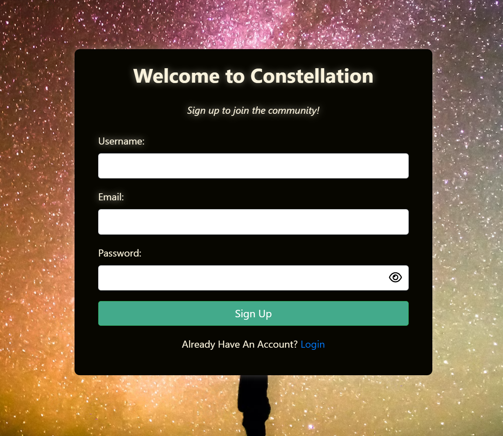
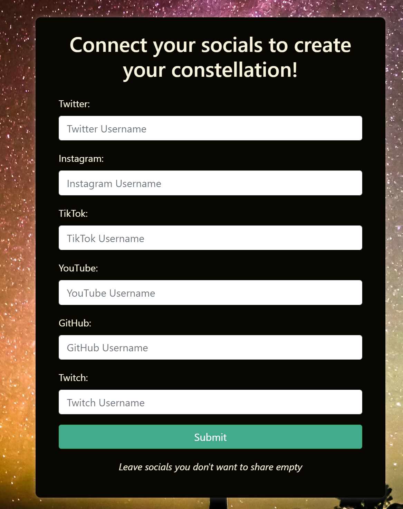
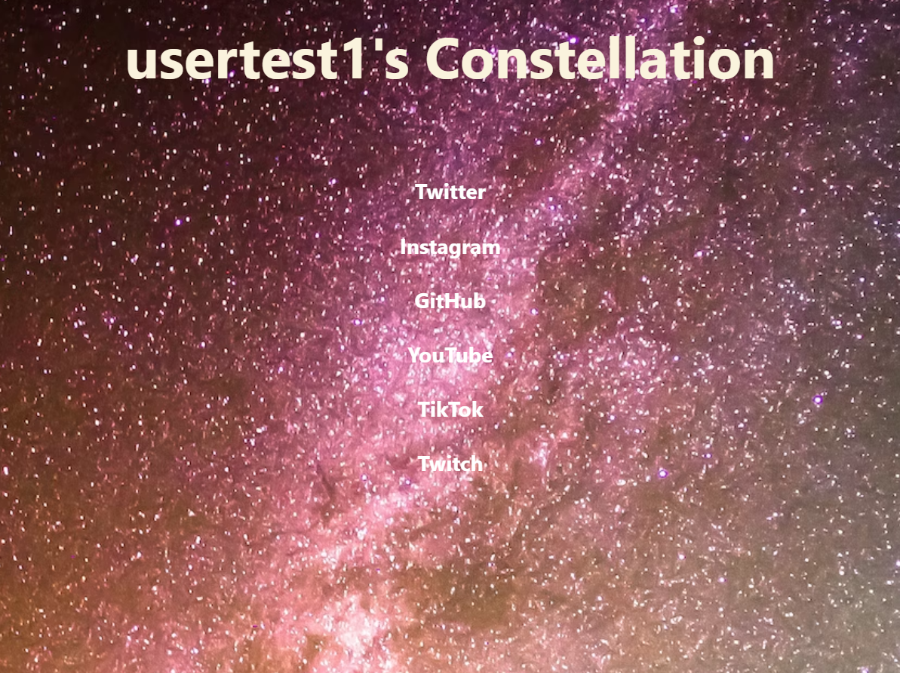

# andromeda
Viva la astra.

## Motivation
- To build a single application that houses ALL of a users' social media / networking accounts. One source for everything, where users can connect with like minds and share pieces of their own.
 
## Screenshots

## Tech/framework used

<b>Built with:</b>
- Bootstrap
- Handlebars
- Express.js

<b>Languages used:</b>
 - [HTML]
 - [CSS]
 - [Javascript]
 - [MySQL]

## Deployed application link

Deployed application: https://constellation-application-b32a4fee0e20.herokuapp.com/

## How to use?
- Upon visiting the application, you can find active users' constellations. These consist of their personal information they choose to provide. To view a users profile and their 'constellation,' select "view profile" from their card. To sign up and create your own, select sign up from the navigation menu. From there, you can add your unique username and email address, as well as your social media accounts. This will then render your newly created profile/constellation, which you can edit/update by visiting the 'social' tab whenever logged in. To login to an existing account, simply select the 'login' option, and to logout, the 'logout' option from the navigation bar.

## Credits

<b>Contributors:</b>

Nic Diaz: https://github.com/nicanthoni
Chris Panelli: https://github.com/Cpanelli
Jaylon Allen: https://github.com/jlonthegrea
Zach G: https://github.com/ZekuzaKeane

## License

MIT © [ZekuzaKeane]()
